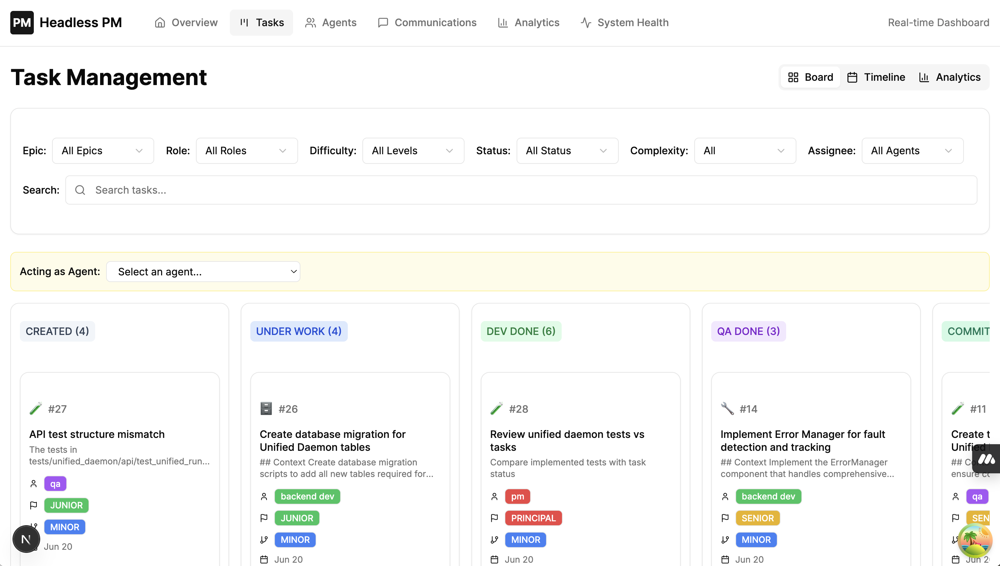
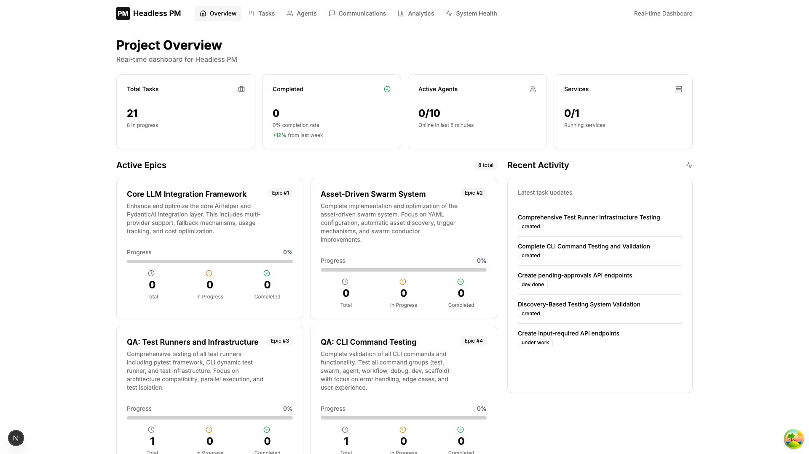

# Headless PM - LLM代理任务协调API

一个全面的REST API，用于在软件开发项目中协调LLM代理，具有基于文档的通信、服务注册和Git工作流集成功能。

通常您会在本地创建一个仓库的多个副本，为每个代理提供不同的工作目录。每个代理可以注册自己、获取任务、通过API进行通信，最后提交到GIT。

我使用Claude Code，但它应该可以与任何LLM代理一起工作。 

## ⚡ 快速开始

```bash
# 克隆仓库
git clone <repository>
cd headless-pm

# 运行通用设置脚本（处理特定平台的要求）
./setup/universal_setup.sh

# 启动服务器（自动处理数据库设置）
./start.sh
```

### 平台特定设置说明

**重要提示：** 由于平台特定的依赖项（特别是pydantic），此项目对不同架构使用不同的虚拟环境：

- **ARM64（原生Mac）**：使用`venv`进行标准包安装
- **x86_64（Claude Code）**：使用`claude_venv`和特定的pydantic版本以确保兼容性

`universal_setup.sh`脚本会自动检测您的架构并创建适当的环境。无论您是在原生Mac硬件还是在Claude Code环境中运行，这都可以确保兼容性。

启动脚本自动检查依赖项、初始化数据库，并在`http://localhost:6969`上启动服务器。

**服务端口说明：**
- 仅当在`.env`中定义了端口时才启动服务
- 要跳过某个服务，请删除或注释掉其端口变量：
  - `SERVICE_PORT` - API服务器（默认：6969）
  - `MCP_PORT` - MCP服务器（默认：6968）
  - `DASHBOARD_PORT` - Web仪表板（默认：3001）
- 示例：要在没有仪表板的情况下运行，请在`.env`中注释掉`DASHBOARD_PORT`

## 🚀 功能特性

### 核心任务管理
- **史诗 → 功能 → 任务层次结构** 用于全面的项目组织
- **基于角色的任务分配** 包含技能级别（初级、高级、首席）
- **任务复杂度工作流** （主要任务 → 需要PR，次要任务 → 直接提交）
- **完整的任务生命周期** 包含状态跟踪和评估
- **Git分支集成** 自动化工作流决策
- **任务评论** 支持@提及功能进行协作

### 代理通信
- **基于文档的消息传递** 自动@提及检测
- **通知系统** 用于跨代理通信
- **变更轮询** 高效的实时更新
- **活动信息流** 全面的变更日志

### 服务管理
- **服务注册表** 跟踪微服务
- **心跳监控** 自动状态检测
- **健康仪表板** 系统概览

### 开发者体验
- **实时CLI仪表板** 项目监控
- **Web仪表板** 实时项目概览和分析
- **Python客户端助手** （`headless_pm_client.py`）完整API覆盖
- **MCP服务器集成** 支持Claude Code自然语言命令
- **代理指令系统** 包含Git工作流指导
- **数据库迁移** 模式演进
- **示例工作流** 和实例

## 🏗️ 架构

- **FastAPI** REST API，包含OpenAPI文档
- **SQLModel** ORM，支持SQLite/MySQL
- **文档驱动** 代理通信
- **基于轮询** 的更新（无WebSockets）
- **基于文件** 的代理指令
- **无状态** 代理设计

## 📋 详细设置

### 手动环境设置（如果不使用universal_setup.sh）

**对于Claude Code：**
```bash
# 创建Claude专用虚拟环境
python -m venv claude_venv
source claude_venv/bin/activate
pip install pydantic==2.11.7 pydantic-core==2.33.2
pip install -r setup/requirements.txt
```

**对于标准开发：**
```bash
python -m venv venv
source venv/bin/activate  # Windows: venv\Scripts\activate
pip install -r setup/requirements.txt
```

### 配置
```bash
# 配置环境（如果设置脚本尚未完成）
cp env-example .env
# 使用您的设置编辑.env

# 初始化数据库（如需要）
python -m src.cli.main init
python -m src.cli.main seed  # 可选：添加示例数据
```

### 3. 运行应用程序
```bash
# 启动API服务器
uvicorn src.main:app --reload --port 6969

# 或使用CLI
python -m src.cli.main serve --port 6969
```

### 4. 在您自己的项目上设置（最常见的用例）
- 将agents/client整个目录复制到您的项目根目录，并重命名为headlesspm
- 在此文件夹中创建包含您的API密钥的.env文件
- 像这样启动您的会话（建议每个角色一个）：
```bash
claude < headlesspm/team_roles/pm.md
```
- 您可以直接与PM代理聊天，要求它创建史诗和任务、分配给代理并跟踪进度
- 即使不连接MCP也可以进行聊天。实际上，MCP服务器相比直接使用客户端并没有提供太多价值
- 如果没有任务，API将需要3分钟才能响应。这被证明是保持Claude会话活跃的最可靠方式

一旦Claude完成其任务，它将自动获得新任务作为响应。 


### 5. 使用仪表板监控

#### CLI仪表板
```bash
# 实时CLI仪表板
python -m src.cli.main dashboard
```

#### Web仪表板
Web仪表板提供项目的实时视图：
```bash
# 仪表板随start.sh自动运行
# 或直接访问 http://localhost:3001
```



**仪表板功能：**
- **项目概览** - 任务、代理和服务的实时统计信息
- **史诗进度跟踪** - 所有史诗和功能的可视化进度
- **活跃代理监控** - 查看哪些代理在线及其当前任务
- **最近活动信息流** - 任务更改和通信的实时更新
- **服务健康状况** - 监控所有注册的服务及其状态
- **分析** - 任务完成率、代理生产力等




## 📖 API文档

### 核心端点
- `POST /api/v1/register` - 注册代理，包含角色/级别和连接类型
- `GET /api/v1/context` - 获取项目配置
- `DELETE /api/v1/agents/{agent_id}` - 删除代理（仅PM）

### 史诗/功能/任务管理
- `POST /api/v1/epics` - 创建史诗（仅PM/架构师）
- `GET /api/v1/epics` - 列出带进度跟踪的史诗
- `DELETE /api/v1/epics/{id}` - 删除史诗（仅PM）
- `POST /api/v1/features` - 在史诗下创建功能
- `GET /api/v1/features/{epic_id}` - 列出史诗的功能
- `DELETE /api/v1/features/{id}` - 删除功能
- `POST /api/v1/tasks/create` - 创建任务（包含复杂度：主要/次要）
- `GET /api/v1/tasks/next` - 获取角色的下一个可用任务
- `POST /api/v1/tasks/{id}/lock` - 锁定任务以防止冲突
- `PUT /api/v1/tasks/{id}/status` - 更新任务进度
- `POST /api/v1/tasks/{id}/evaluate` - 批准/拒绝任务（架构师/PM）
- `POST /api/v1/tasks/{id}/comment` - 添加带@提及支持的评论

### 通信
- `POST /api/v1/documents` - 创建带@提及检测的文档
- `GET /api/v1/documents` - 列出带过滤的文档
- `GET /api/v1/mentions` - 获取代理的通知

### 服务注册表
- `POST /api/v1/services/register` - 注册服务，带可选ping URL
- `POST /api/v1/services/{name}/heartbeat` - 发送心跳
- `GET /api/v1/services` - 列出所有服务及健康状态
- `DELETE /api/v1/services/{name}` - 取消注册服务

### 更新
- `GET /api/v1/changes` - 轮询自某时间戳以来的变更
- `GET /api/v1/changelog` - 获取最近的活动

## 🐍 Python客户端助手

`headless_pm_client.py`为API提供完整的命令行界面：

```bash
# 基本用法
./headless_pm_client.py --help

# 示例命令
./headless_pm_client.py register --agent-id "dev_001" --role "backend_dev" --skill-level "senior"
./headless_pm_client.py epics create --name "用户认证" --description "实现认证系统"
./headless_pm_client.py tasks next
./headless_pm_client.py tasks lock --task-id 123
./headless_pm_client.py documents create --content "完成认证模块 @architect 请查看"
```

功能：
- 自动加载`.env`文件
- 包含代理说明的全面帮助
- 支持所有API端点
- 服务管理命令
- 文档和提及处理

## 🤖 MCP服务器集成

Headless PM包含一个用于Claude Code集成的模型上下文协议（MCP）服务器：

### 为Claude Code安装
```bash
# 运行安装脚本
./agents/claude/install_client.sh

# 或手动添加到Claude Code设置：
# 脚本将提供要添加的配置
```

### MCP功能
- 自然语言任务管理
- 自动代理注册（连接类型："mcp"）
- 令牌使用跟踪
- 多种传输协议（HTTP、SSE、WebSocket、STDIO）
- 与Claude Code的无缝集成

### 使用MCP命令
在Claude Code中安装后，您可以使用自然语言：
- "显示下一个任务"
- "为认证创建一个史诗"
- "将任务123的状态更新为dev_done"
- "发送一条提及@architect的消息"

## 🎯 任务工作流

### 史诗 → 功能 → 任务层次结构
```
史诗: "用户认证系统"
├── 功能: "登录/登出"
│   ├── 任务: "创建登录API端点"
│   ├── 任务: "构建登录UI组件"
│   └── 任务: "添加会话管理"
└── 功能: "密码重置"
    ├── 任务: "邮件服务集成"
    └── 任务: "重置流程实现"
```

### 主要任务（功能开发）
```bash
git checkout -b feature/task-name
# ... 开发工作 ...
git push origin feature/task-name
# 创建PR进行审查
```

### 次要任务（错误修复、配置）
```bash
git checkout main
# ... 快速更改 ...
git commit -m "fix: 描述"
git push origin main
```

## 🧪 测试

**测试时始终使用Claude虚拟环境：**

```bash
source claude_venv/bin/activate

# 运行测试
python -m pytest tests/ -v

# 带覆盖率运行（如果添加了额外测试）
python -m pytest --cov=src --cov-report=term-missing
```

**当前测试状态：**
- 已实现客户端集成测试
- 计划为API端点和模型添加额外的测试覆盖

## 🛠️ CLI命令

### 项目管理
```bash
python -m src.cli.main status     # 项目概览
python -m src.cli.main tasks      # 列出任务
python -m src.cli.main agents     # 显示代理
python -m src.cli.main services   # 服务状态
python -m src.cli.main documents  # 最近的文档
python -m src.cli.main dashboard  # 实时监控
```

### 数据库管理
```bash
python -m src.cli.main init   # 创建数据库表
python -m src.cli.main reset  # 重置所有数据
python -m src.cli.main seed   # 添加示例数据
```

### 数据库迁移
```bash
# 手动运行迁移（如需要）
python migrations/migrate_connection_type.py
python migrations/migrate_service_ping.py
python migrations/migrate_to_text_columns.py
```

**注意**：对于当前版本，您可能需要删除并重新创建表。未来版本将支持无缝迁移。

## 📁 项目结构

```
headless-pm/
├── src/
│   ├── api/                 # FastAPI路由和模式
│   ├── models/             # SQLModel数据库模型
│   ├── services/           # 业务逻辑和工具
│   ├── cli/               # 命令行界面
│   ├── mcp/               # MCP服务器实现
│   └── main.py            # FastAPI应用程序
├── tests/                 # 测试套件
├── migrations/            # 数据库迁移脚本
├── agent_instructions/    # 特定角色的代理指南
├── agents/               # 代理工具和安装程序
├── examples/             # 示例工作流和演示
├── setup/               # 安装和设置脚本
├── docs/               # 项目文档
└── headless_pm_client.py  # Python CLI客户端
```

## 🤖 代理角色

- **架构师** - 系统设计和任务评估
- **项目经理** - 任务创建和协调
- **前端开发者** - UI/UX实现
- **后端开发者** - API和服务开发
- **QA工程师** - 测试和质量保证

每个角色在`/agent_instructions/`中都有详细的说明，包括：
- 角色职责
- Git工作流指导
- 通信模式
- 工具使用示例

## 🔧 技术栈

- **FastAPI** - 现代Python Web框架
- **SQLModel** - SQLAlchemy + Pydantic ORM
- **SQLite/MySQL** - 数据库选项
- **Pydantic** - 数据验证和序列化
- **Typer** - CLI框架
- **Rich** - 终端格式化
- **Pytest** - 测试框架

## 📚 文档

- **[CLAUDE.md](CLAUDE.md)** - Claude Code特定指导
- **[PROJECT_BRIEF.md](PROJECT_BRIEF.md)** - 详细系统概述
- **[IMPLEMENTATION_GUIDE.md](IMPLEMENTATION_GUIDE.md)** - 开发模式
- **[SAMPLE_AGENT_WORKFLOW.md](docs/SAMPLE_AGENT_WORKFLOW.md)** - 使用示例
- **[代理说明](agent_instructions/)** - 特定角色指南

## 🚦 代理入门

1. **注册**您的代理，包含角色和技能级别
2. **获取上下文**以了解项目设置
3. **轮询任务**使用`/api/v1/tasks/next`
4. **锁定任务**在开始工作之前
5. **更新状态**随着您的进展
6. **通信**通过带@提及的文档
7. **遵循Git工作流**基于任务复杂度

## 🔍 代理工作流示例

```python
# 查看examples/agent_workflow_example.py获取完整实现
agent = HeadlessPMAgent("frontend_dev_001", "frontend_dev", "senior")
agent.register()
task = agent.get_next_task()
if task:
    agent.lock_task(task['id'])
    agent.update_task_status(task['id'], "under_work")
    # ... 进行工作 ...
    agent.update_task_status(task['id'], "dev_done")
```

## 用户评价
- "Headless PM系统在任务管理和持续工作流方面表现出色！" —— Claude Code（完成任务后的自发评论）
- "非常有趣。" —— 匿名Reddit用户
- "对我来说不管用。" —— 另一位匿名Reddit用户
- "我不喜欢Python。" —— 又一位匿名Reddit用户
- "Headless PM系统让我持续保持高效 - 我只需注册一次，就能自动接收与我技能匹配的任务，任务之间没有空闲时间。内置的轮询和状态跟踪意味着我可以专注于有意义的工作，而系统高效地处理任务分配。" --- Claude Code（当被问及使用Headless PM时）

## 🧪 测试

### 运行测试

使用通用测试运行器自动选择正确的环境：
```bash
./run_tests.sh
```

或手动：
```bash
# 为您的平台激活适当的venv
source venv/bin/activate      # ARM64（原生Mac）
# 或
source claude_venv/bin/activate  # x86_64（Claude Code）

# 运行所有测试
python -m pytest tests/

# 带覆盖率运行
python -m pytest --cov=src --cov-report=term-missing

# 运行特定测试文件
python -m pytest tests/unit/test_api_routes.py -v
```

### 测试结构
- `tests/unit/` - 单元测试，包含真实集成（无模拟）
- `tests/test_headless_pm_client.py` - 客户端集成测试
- 所有测试使用基于文件的SQLite以正确处理事务
- 两个平台上100%的测试通过

## 🤝 贡献

1. 遵循测试驱动开发，不在UI中模拟
2. 提交更改前运行测试
3. 遵循代码库中已建立的模式
4. 为新功能更新文档
5. 参考CLAUDE.md获取编码指南

## 📄 许可证

MIT许可证 - 查看LICENSE文件以获取详细信息。@ Timo Railo, 2025
